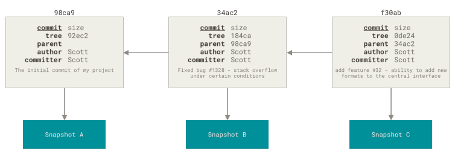
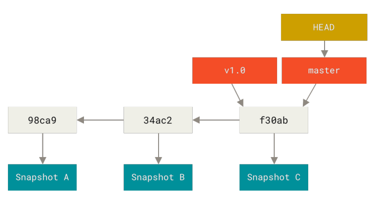

# 2.2 大杀器之 git 的分支操作

使用 git 的同学一定绕不开分支这个概念，你会发现 git 分支非常方便，而且分支切换非常的快速。

git 官网那本书是这么描述的：

    有人把 Git 的分支模型称为它的 “必杀技特性”，也正因为这一特性，使得 Git 从众多版本控制系统中脱颖而
    出。 为何 Git 的分支模型如此出众呢？ Git 处理分支的方式可谓是难以置信的轻量，创建新分支这一操作几乎能
    在瞬间完成，并且在不同分支之间的切换操作也是一样便捷。 

## 2.2.1 git 的数据模型

得益于 Git 保存的每个版本不是文件的变化或者差异，而是一系列不同时刻的快照

git 简史那张介绍过：

* 基于差异的版本控制 （SVN）

* 基于快照的（Git）

通过上图不难看出：
1. 基于差异的方式，在切换分支的时候，需要经过文件内容的计算才能得到完整的该版本的内容
2. 基于快照的方式，在切换分支的时候，直接切换到当前版本即可

## 2.2.2 git 的提交对象（commit object）

为了方便理解，这里先简单描述下提交对象的设计，后文会更加详细介绍

提交对象会包含一个指向暂存内容快照的指针、作者的姓名和邮箱、提交时输入的信息以及指向它的父对象的指针
- 第一个提交没有父对象指针
- 多个分支合并产生的提交有多个父对象指针

图中可以看出：
- 这里有三个提交对象，分别指向一个内容快照（snapshot）
- 提交对象指向父对象
- 每个提交对象有一个唯一的 hash 值

## 2.2.3 分支的切换

有了上边的铺垫，分支切换就好理解了。 想了解分支的切换，就要先知道分支是什么？

**分支就是指向提交对象的一个指针**

上图中有两个分支：
- master
- v1.0

HEAD 指向的是本地当前的分支

那么分支切换的动作就非常简单，就是两件事情：
1. 移动 HEAD 指针到切换的分支
2. 工作目录切换成新分支指向的快照

## 2.2.4 小节

现在可以理解了，为什么 git 的分支切换如此迅速，而且是非线性的，切换的速度与项目中有多少分支数量关系不大。
