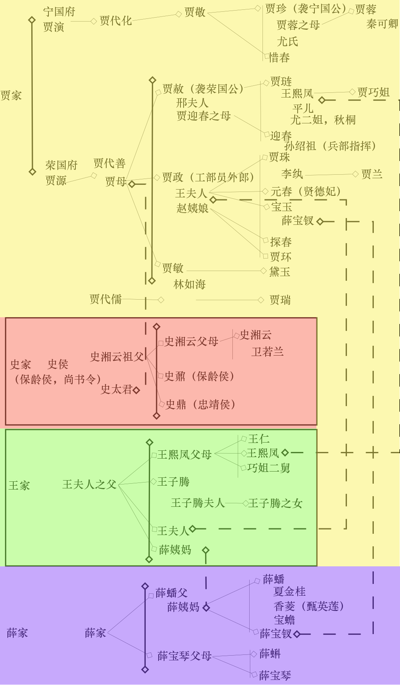

# 第二回 贾夫人仙逝扬州城 冷子兴演说荣国府

## 故事大意

曹雪芹在第二回把读者从第一回玄幻的梦境里拉回了现实。其实主要就是两件事，标题其实就是大意

* 贾夫人仙逝扬州城 -- 贾夫人，这里特指贾敏，林黛玉的亲生母亲。从而引出林黛玉这一主人公。
* 冷子兴演说荣国府 -- 借助冷子兴的嘴，介绍了四大家族的人物和背景，尤其是贾家的荣国府和宁国府。

### 引出林黛玉

书接上回，那位新太爷就是贾雨村。贾雨村找到甄士隐的岳父封肃询问甄士隐的下落，听说甄英莲丢失，甄士隐也出了家后 也是一声叹息。临走，还给了封肃二两银子。然而第二天贾雨村用了两封银子（据说大概一百两）索要娇杏做二房（就是第一回贾雨村看中的那个丫鬟）。娇杏这丫鬟很有运气，一年之后由于嫡妻下世而被扶成正室。

好景不长，由于被上司寻了个空隙，参他一本，贾雨村被革职。贾雨村好似看的很开，开始游览天下胜迹。贾雨村到扬州时，听说了林如海（兰台寺大夫），他就是林黛玉的父亲，作者大致介绍了一下林如海的背景。贾雨村打听到林如海想招聘一位家庭教师，就拖友人谋了进去。教的是一位女孩。

女学生便是五岁多的林黛玉，她之前有个三岁就死了的弟弟。文中介绍了林黛玉出生就吃药，身体又极怯弱。一年之后，林黛玉的母亲去世了，黛玉“侍汤奉药，守丧尽哀”。可以看到，本回介绍的主角林黛玉大致有几个特点：

1. 体弱多病
2. 热爱读书
3. 懂事
4. 被父亲爱如珍宝

### 冷子兴大话荣国府

雨村在一次闲逛时，看到了旧日在都的相识冷子兴，两人热聊起来。有趣的是，曹雪芹这样形容他俩，“雨村最赞这冷子兴是个有作为大本领的人，这子兴又借雨村斯文之名，故二人说话投机，最相契合。” 其实是互相利用，各取所需。雨村因问：“近日都中可有新闻没有？” 子兴说没有，但是你同宗的贾家到时有些怪事，从而引出对贾家的介绍。

首先聊到宁荣两府的衰落问题。贾雨村说之前路过宁荣二府的时候没有觉得衰落。子兴回道“百足之虫，死而不僵。”冷子兴认为，二府的病症主要是“安富尊荣者尽多，运筹谋画者无一”，即不够节俭。另外认为最重要的问题是子女的教育问题，一代不如一代。从而引出贾府的主要人物和后代。红楼梦人物众多，上个图便于理解，下边会按照原文，描述一下主要的人物：



* 容国公（贾源）宁国公（贾演）一母同胞弟兄两个。
* 宁国府
  * 贾代化：袭了官
  * 贾敬：贾代化的次子，袭了官，但是沉迷炼丹，其他都不想管。
  * 贾珍：贾敬的儿子，父亲让他袭了官，也不爱读书，一味的寻欢作乐。生了个儿子叫贾蓉。
* 荣国府
  * 贾代善：袭了官，娶史侯家的小姐为妻（贾母），太夫人尚在。长子贾赦袭着官
  * 贾政：贾代善次子，酷喜读书，任工部员外郎。娶了王夫人。
  * `贾宝玉：贾政与王夫人的二胎。一落胎胞，嘴里便衔下一块五彩晶莹的玉来，上面还有许多字迹，就取名叫作宝玉。`宝玉名言：“女儿是水作的骨肉，男人是泥作的骨肉。我见了女儿，我便清爽；见了男子，便觉浊臭逼人。”。
  * 贾琏：亲上作亲， 不肯读书。`娶的就是政老爹夫人王氏之内侄女，王熙凤。王熙凤被被大家称颂。`

聊到贾宝玉，冷子兴认为宝玉“将来酒色之徒耳”，贾雨村不以为意，和冷子兴来了一大段的哲思。原文节选：“天地生人，除大仁大恶两种，馀者皆无大异。若大仁者，则应运而生，大恶者，则应劫而生”。这段很长，网络上应该有很多分析，大家自行查阅吧。

最后聊到姐妹，冷子兴介绍了贾家的几个女生。

* `贾元春：贤孝才德，选入宫中作女史`
* 贾迎春、贾探春、贾惜春：  贾母很爱孙女，都跟在祖母读书。

不知聊了多久，村向窗外看道：“天也晚了，仔细关了城。我们慢慢的进城再谈，未为不可。”于是，二人起身，算还酒帐。方欲走时，又听得后面有人叫道：“雨村兄，恭喜了！特来报个喜信的。” 这个报喜的是谁，下回分解。

本回结束。

## 金句/诗句

作者解释为什么要借冷子兴之嘴演说荣国府，即“须问旁观冷眼人”。

```shell
一局输赢料不真，香销茶尽尚逡巡。
欲知目下兴衰兆，须问旁观冷眼人。
```

贾雨村偶至郭外有一个庙宇“智通寺”上的对联，看似白话却也充满了深意。好像再说贾雨村自己“是非成败转头空”。

```shell
身后有馀忘缩手，眼前无路想回头。
```

说的是娇杏这丫鬟很走运。

```shell
偶因一着错，便为人上人。
```

## 其他

* 本回是通过旁观人（冷子兴）之嘴，介绍了红楼梦里的主要人物，实实虚虚。
* 另一个角度看就是如果想知道一件事情的事实，不要去问当事人，而是去问旁观人。
