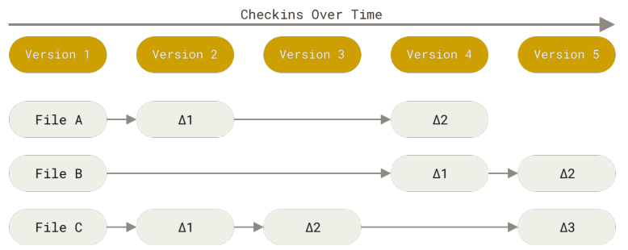
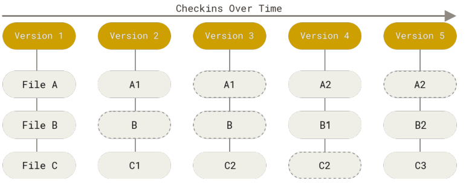

# 1. git 简史

## 1.1 版本控制系统（VCS - Version Control System）

版本控制系统是一种能够记录一个或若干文件内容变化，以便将来查阅特定版本修订情况的系统。

举个简单的例子，我们写毕业论文的时候，会经常的修改，以至于会产生很多版本：

* 毕业论文 - 初版.doc
* 毕业论文 - 最终版.doc
* 毕业论文 - 最终版之打死不改版.doc
* 毕业论文 - 最终版之打死不改版 1.doc

如上，如果没有版本控制系统，你对论文各个版本的维护将是个很大的难题。

论文的管理尚且还能人力来管理，对代码的版本管理简直可以说不可能，它将会是一个灾难。因为代码修改的版本数量大，项目周期长，复杂已经不是一个等级了。因此，版本控制系统就有其必要性。

版本控制系统主要有如下几种类型：本地版本控制系统、集中化的版本控制系统、分布式版本控制系统。

### 1.1.1 本地版本控制系统

* 单人使用
* 原理是在硬盘上保存补丁集（补丁是指文件修订前后的变化）；通过应用所有的补丁，可以重新计算出各个版本的文件内容
* `据说`比较流行的一种叫 RCS（Revision Control System RCS - GNU Project - Free Software Foundation）

### 1.1.2 集中化的版本控制系统（Centralized Version Control Systems，简称 CVCS）

* 多个开发者可以系统工作
* 有一个集中的共享仓库，所有开发者都跟他交互
* 开发者可以向服务端拉取指定版本的快照
* 典型的系统是 SVN
* `坏处是`服务器单点故障后，谁都不能工作

### 1.1.3 分布式版本控制系统（Distributed Version Control System，简称 DVCS）

* 分布式的关键就是每个开发者可以独立工作，即使和远程仓库断网
* `核心原理`就是客户端有完整的项目克隆，包括完整的历史记录
* `git` 就是最流行最典型的分布式版本控制系统

## 1.2 git 的诞生与发展（<https://git-scm.com/book/zh/v2/%E8%B5%B7%E6%AD%A5-Git-%E7%AE%80%E5%8F%B2>）

* 1991-2002    Linux 内核有众多开发者，大多数精力花在了补丁和归档相关的事情
* 2002-2005    使用 bitkeeper 来管理
* 2005         与 bitkeeper 合作结束

最终，迫使 Linux 开源社区（特别是 Linux 的缔造者 Linus Torvalds）开发出自己的版本系统。 他们对新的系统制订了若干目标：

* 速度
* 简单的设计
* 对非线性开发模式的强力支持（即允许成千上万个并行开发的分支）
* 完全分布式
* 有能力高效管理类似 Linux 内核一样的超大规模项目（速度和数据量）

## 1.3 版本记录是记录快照还是文件的 diff？

不难想出，版本管理可以有两种思路

基于文件 diff 的

* 每一个版本只记录与上一个文件变化的内容
* 好处是存储的数据少，坏处就是切换分支代价高

基于文件快照的

* 每个版本都记录全量的文件内容
* 好处就是切换分支很快，坏处就是存储的数据量多很多
* `git 就是基于这种方式设计的`

后续会讨论这种方式带来的好处。
