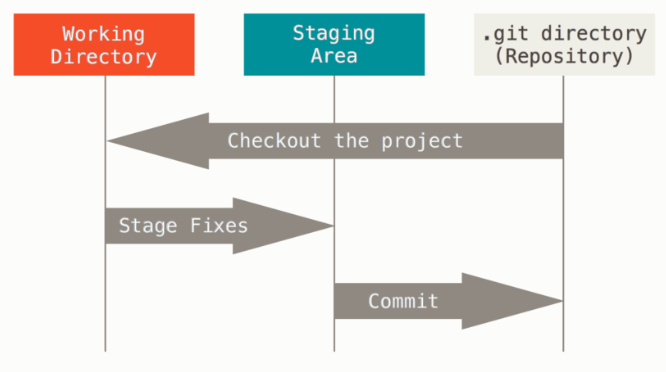
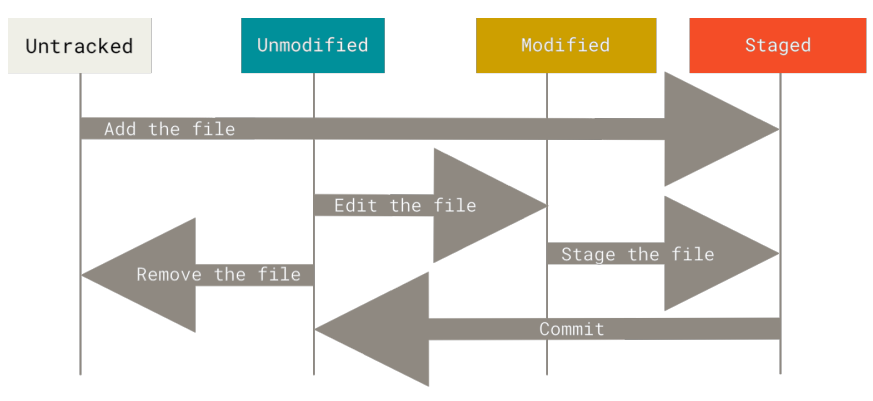

# 2.1 不得不了解的 git 工作区和 “三个状态”

从本节开始，将不局限于简单的使用 git， 而是相对深入的介绍一些 git 的基本概念和原理，这样会有助于你理解 git， 出了问题时知道如何去解决，而不是茫然无措。

## 2.1.1 git 的工作区、暂存区、与 .git 目录



上图包含了 git 里非常重要的几个概念：

- 工作区：项目某个版本的内容，从 git 仓库提取出来的内容，简单点说就是你打开 IDE 之后能看到的每个文件的内容，它在你的硬盘上供你修改。
- 暂存区：暂存区保存了下次将要提交的文件列表信息。
- git 仓库目录（.git 目录）：Git 用来保存项目的元数据和对象数据库的地方，`这个目录非常重要（后边会详细讲解）`

git 典型的工作流如下：

1. 工作区修改一个或者多个文件。
2. 将下次想要提交的文件暂存（staged）
3. 提交，把暂存区里的文件提交到 .git 仓库目录里

## 2.1.2 “三个状态”

上个小节介绍了典型的 git 工作流，本小节介绍一下 git 工作流中文件的几个状态，这两个小节配合在一起更好理解。



上图说明了一个文件在 git 工作流中的几个状态：

- 已提交（committed）
- 已修改（modified）
- 已暂存（staged）

解释一下上图的工作流：

1.最开始一个文件属于 `未追踪（Untracked）` 状态, 此时可以说不被 git 管理

```shell
$ echo 'My Project' > README
$ git status
On branch master
Your branch is up-to-date with 'origin/master'.
Untracked files:
  (use "git add <file>..." to include in what will be committed)
  README
nothing added to commit but untracked files present (use "git add" to
track)
```

2.通过 `git add README` 可以把文件加入到暂存区，文件变成`已暂存（staged）`，纳入 git 管理。`Changes to be committed` 下边显示的文件就是已经暂存的。

```shell
$ git status
On branch master
Your branch is up-to-date with 'origin/master'.
Changes to be committed:
  (use "git restore --staged <file>..." to unstage)
  new file: README
```

3.编辑项目中一个已有的文件`CONTRIBUTING.md`，文件变成`已修改（modified）`。这时一个文件是已修改（CONTRIBUTING.md 文件），一个文件是已暂存（README文件）。

```shell
git status
On branch master
Your branch is up-to-date with 'origin/master'.
Changes to be committed:
  (use "git reset HEAD <file>..." to unstage)
  new file: README
Changes not staged for commit:
  (use "git add <file>..." to update what will be committed)
  (use "git checkout -- <file>..." to discard changes in working
directory)
  modified: CONTRIBUTING.md
```

4.执行```git add CONTRIBUTING.md``` 后所有文件都暂存了。

```shell
$ git status
On branch master
Your branch is up-to-date with 'origin/master'.
Changes to be committed:
  (use "git reset HEAD <file>..." to unstage)
  new file: README
  modified: CONTRIBUTING.md
```

5.通过 `git commit` 可以把暂存的文件提交。

6.如果有远程仓库的话，可以通过 `git push` 进行推送。

总结一下：

1. `git add` 可以把文件加入暂存区
2. `git commit` 可以提交暂存区的文件
3. `git push` 可以推送已经提交的 commit

补充一点： `git commit`  与 `git commit -a`, 加上 -a 参数，可以自动把没有暂存的文件进行暂存。

通过阅读本小节，你应该知道 git 基本的工作流和一个文件提交过程中的几个基本状态。