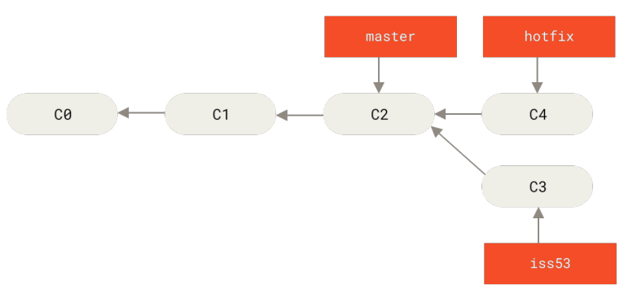
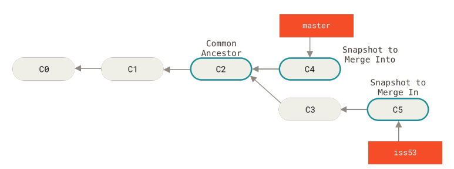
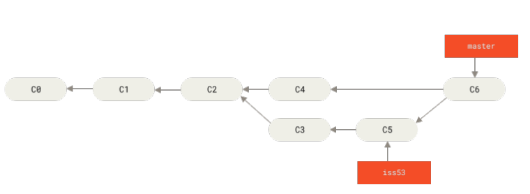
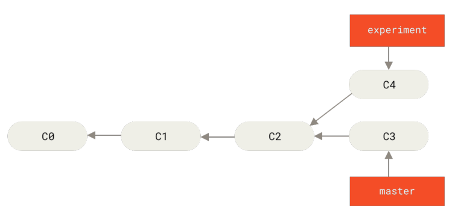
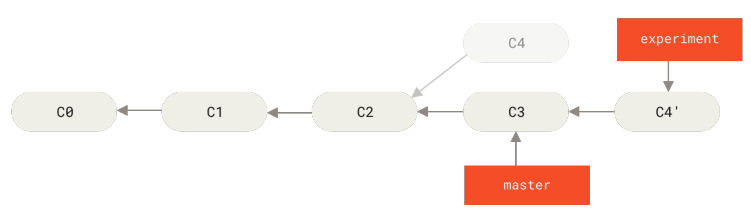

# 2.3 你知道合并（merge）和变基（rebase）的区别吗

git 的最大功效还是多人的合作开发。典型的多人合作开发模式是这样的：

1. 大家共享一个主干分支（master）
2. 每个开发者有新的开发需求都从主干 checkout 出来一个新的分支，进行开发
3. 开发完成之后需要合并会主干

这样就会出现两个分支合（merge）并成一个分支的场景

合并也是 git 中非常重要的一个概念，本小节将会重点介绍合并

### 2.3.1 合并（merge）


#### 快进式合并(fast-forward)


看一下这个场景：
1. 开发者A 做了一个 hotfix，并创建基于 master（C2）了 hotfix 分支
2. 开发完成之后需要把 hotfix(C4) 分支合并会主干

```shell
git checkout master
git merge hotfix
```

这种合并过程会很简单，只需要把 C4 追在 C2 后边就行了，拓扑没有发生变化。这种合并被称为`快进式合并(fast-forward)`

快进式合并(fast-forward) 会让整课提交树非常简单，那就是`直接移动 master 指针`到 C4 即可。


#### 三路合并模式

当然了，不是所有的合并都是快进式合并，还有一种非常普通的三路合并模式



这种情况：如果想把 iss53 分支合并到 master 分支，就不能简单的快进式合并了。

特点就是 master 和 iss53 有公共的组件，但是这棵树分叉了。言外之意出现了代码冲突，无法直接合并



```shell
git checkout master
git merge iss53
```

这种情况的合并过程如上图所示：
1. 先创建出来一个新的提交 C6 ， C6 的合并过程要参照（公共祖先  C2, 和两个合并的分支 C5、 C4）, 因此被称为 三路合并
2. 然后把 master 指针移动到 C6 即可


### 2.3.2 变基（rebase）

变基也是非常有意思的一种合并方式。

变基的命令如下：

```shell
git checkout experiment
git rebase master 
```



变基过程如下：
1. 先找到与目标基底 master 的公共祖先（C2）
2. 对比当前分支相对于祖先的历次历史提交（C4），产生临时提交（C4'）
3. 依次向目标基底（master）应用这些临时提交(C4' 追到 C3 的后边)




如上图所示，reabse 之后有几个结果：
1. C4 提交丢了
2. master 可以快进式合并了
3. 变基操作的实质是丢弃一些现有的提交，然后相应地新建一些内容一样但实际上不同的提交。
4. 变基使得提交历史更加整洁（一条链）

因此通过 rebase + 快进式提交 也是一种合作模式。

### 2.3.3 merge 和 rebase 怎么选择
- 认为 merge 的观点：有一种观点认为，仓库的提交历史即是*记录实际发生过什么*。 它是针对历史的文档，本身就有价值，不能乱改。你使用*谎言*掩盖了实际发生过的事情。 如果由合并产生的提交历史是一团糟怎么办？ 既然事实就是如此，那么这些痕迹就应该被保留下来，让后人能够查阅。
- 认同 rebase 的观点：另一种观点则正好相反，他们认为提交历史是项目过程中发生的事。 没人会出版一本书的第一版草稿，软件维护手册也是需要反复修订才能方便使用。


各有各的道理，你怎么选择呢？
