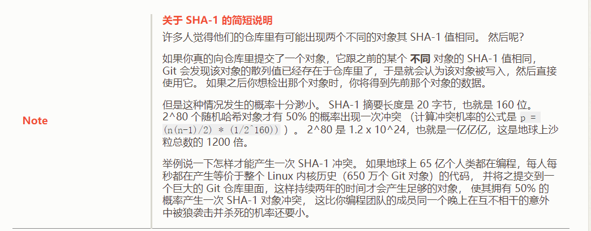
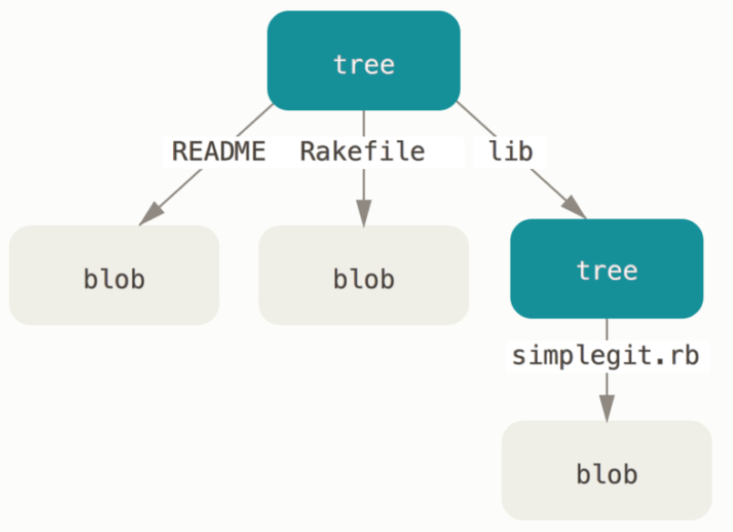
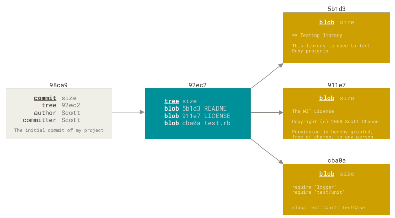

# 3.2 优雅的 git 核心对象设计

试想一下，如果你来设计 git ，你觉得 git 要解决的核心问题是什么呢？

思考一下： 关键的问题如下：

1. 文件内容（数据）的存储
2. 版本切换的时候，文件内容的重现，也就是数据的检索


因此数据的存储和检索就是 git 要核心解决的问题。

### 3.2.1 内容寻址文件系统

git 是一个内容寻址文件系统： 核心就是`键值对数据库`
* 你可以向 Git 仓库中插入任意类型的内容，它会返回一个唯一的键，通过该键可以在任意时刻再次取回该内容。
* 值：就是存储的数据内容
* 键：sha1 (待存储的数据 + 头部信息)， 具体头部信息的内容如何不是重点，感兴趣可以私下查阅。

关于 sha1  通常 8 到 10 个字符就已经足够在一个项目中避免 SHA-1 的歧义。 例如，到 2019 年 2 月为止，Linux 内核这个相当大的 Git 项目， 其对象数据库中有超过 875,000 个提交，包含七百万个对象，也只需要前 12 个字符就能保证唯一性。

### 3.2.2 .git/objects 对象数据库

`.git/objects ` 目录就是核心存放对象的数据库

](img/%E5%BE%AE%E4%BF%A1%E6%88%AA%E5%9B%BE_20240201200848.png)


可以看到该目录的文件布局
1. 每个文件名都是一个 sha1 的 hash 值
2. 为了加速检索，会把 hash 值的前两个字母作为第一层目录

这就是所谓的键值对数据库，你可以可以自己添加一个新的数据，可以用 git 底层命令：

```shell
$ echo 'test content' | git hash-object -w --stdin
d670460b4b4aece5915caf5c68d12f560a9fe3e4
```

返回的这串 hash 值，就会以文件名字的形式出现在 objects 目录下：
```shell
.git/objects/d6/70460b4b4aece5915caf5c68d12f560a9fe3e4
```

你可以通过 git 底层命令查看文件内容:
```shell
$ git cat-file -p d670460b4b4aece5915caf5c68d12f560a9fe3e4
test content
```

以上就是 git 最核心的对象数据库系统，很简单吧！下边就开始介绍 git 的核心对象。

### 3.2.3 数据对象 Blob
每一个文件的每个版本都会单独保存在一个键值文件里，松散平铺 object 目录里，这个存储文件内容类型的对象就是 `Blob` 对象


如图所示，通过 git 底层命令可以看出这个 hash 值对应的数据类型是 blob，文件的内容也可以看出来，是个 go.sum 文件的内容。

如果只有 blob 对象，是不够的：

1. 没有记录文件名
2. 没有目录的概念

就导致无法还原整个文件的目录结构。因此`树对象`就产生了。

### 3.2.3 树对象 Tree

为了解决文件名的保存，以及目录树结构的保存，树对象应运而生，（意义有点像文件系统的目录项）


同样的，可以通过 git 底层命令看出树对象的内容：
1. 树对象文件存的数据不是文件内容，而是这个树节点下边的子节点
2. 子节点可能是 blob 对象，也可能还是个数对象



上图就很清楚的表明了树对象和 blob 的关系。有了这两个对象就可以构建一个完整的目录的文件了。

下边新的问题来了：
1. 文件有不同版本的时候，我无法记住哪颗树的 SHA-1 值是我想要的版本的快照
2. 每次提交的先后关系也不知道

因此，提交对象(commit) 诞生！

### 3.2.4 提交对象 Commit


提交对象里记录的关键信息有两个：
1. 这次提交对象的一颗树对象，有了它就能还原这次提交的所有内容
2. 这次提交的父提交，就能知道提交的图

至此：核心对象就介绍完了，他们之间的关系如下：



提交 -> 树 -> 子树 -> blob


有了提交对象，我还需要有个机制跟提交对象建立联系，否则无法知道谁、某个分支对应着哪次提交，因此引用的概念就来了

### 3.2.5 引用


上图所示：在 refs 目录下有很多的引用，他们都指向某一个 commit 对象。把引用加上之后，git 对象的关系就如下图所示：


此时引用可以理解分支。关于引用还有其他一些情况：


`HEAD 引用`：指向目前所在的分支，通过下图 HEAD 文件内容看出。


`标签对象`： 标签对象类似提交对象，固化到一个snapshot上。跟提交对象的区别就是标签对象指向一个提交对象，而不是一个树对象。 它像是一个永不移动的分支引用

](img/image.png)

### 3.2.6 git 的垃圾回收（GC）

```shell
git gc
```

由于 git 的设计是每个版本都会存储一会完整的文件内容，就会造成一个问题：一个大文件每次都只改一两行的话，就会产生很多存储空间的浪费。

因此 Git 会时不时地将多个这些对象打包成一个称为“包文件（packfile）”的二进制文件，以节省空间和提高效率。具体方法是：只完整保存其中一个的完整版，其他对象都是只保存与之前版本的差异内容。

另外有趣的地方在于，一般是新的版本完整保存了文件内容，而原始的版本反而是以差异方式保存的——这是因为大部分情况下需要快速访问文件的最新版本。

关于 gc，大家可以自行实验。

### 3.2.7 小节

至此，git 的核心对象就介绍完了。不得不感叹 git 设计的优雅性，不论你是否使用 git，都应该好好学习一下 git 核心对象的设计。
