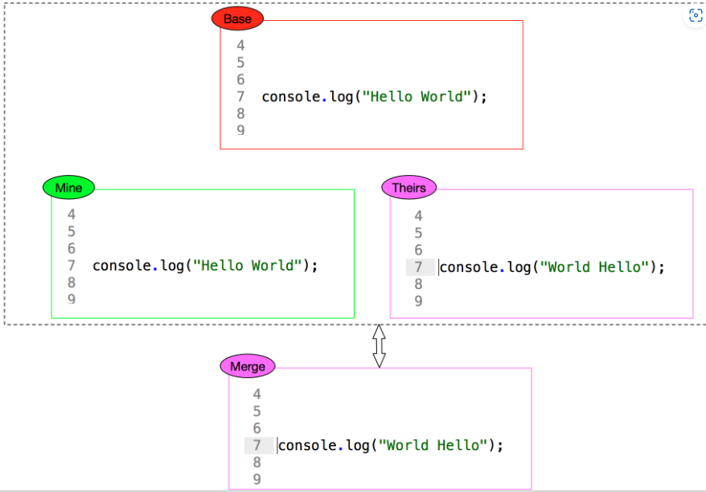
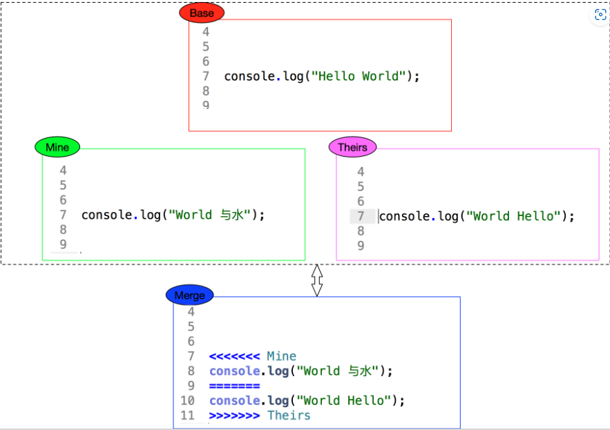
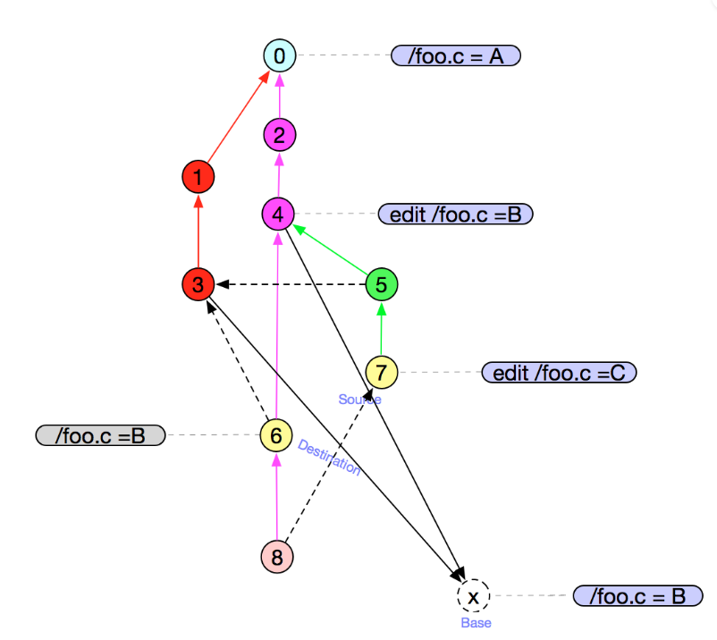

# 3.3 git merge 在做什么

前文已经介绍过合并的过程，主要目的是把两个分支的内容合并的到一个分支上。

这两个分支合并的过程中，不可避免的会产生冲突需要解决。

git 的哲学是聪明地决定无歧义的合并方案，但是如果有冲突，它不会尝试智能地自动解决它。

## 3.3.1 git merge 的原理

当两个文件有冲突的时候，就需要进行 merge，merge 的原则是什么呢？

可能你能想到一种办法就是按照时间先后的原则，即使用后提交的内容，即后面覆盖前面的。简单想一下就不可靠，因为 git 是分布式的文件版本控制系统，在分布式环境中时间是不可靠的。 因此需要另寻他法。常见的就是“三路 merge 大法”。

## 3.3.2 二路合并

基于时间的前后顺序不行，那就可以规则严格一点，只要两行不一样，就让人工来决定。


git 谁都不敢得罪，但是开发者很累。因此，三路 merge 方法诞生。

## 3.3.3 三路合并

### git 自动合并的场景


* 两行内容不一样时，根据他们以前的一个base 提交（共同的历史 commit，具体如何选择后边会说明），最终会选择与 base 不一样的那行内容。
* 原理不难理解，跟 base 不一样的那个版本，有修改的意愿，所以就直接选择用它。

### 不能自动合并的场景



* 就是发现两边都与 base 一样时，说明都有意愿修改这一行，就产生了实质的冲突，此时就需要人工来解决了。

这就是“三路合并”。

### 如何选择 "base 提交"

简单的场景就是找到公共的祖先

* base 提交就是 C2

看个相对复杂一点的


* 目标是 6 跟 7 做 merge
* 6 是 3 和 4 的merge
* 7 是 3 和 5 的merge
* 此时发现 3和 4 都是公共祖先，那怎么选呢？


* 方案就是：基于 3 和 4 做一次merge 得出个虚拟的 “base 提交”
* 3 和 4 merge 时，选择公共祖先 0 作为 base

总结一下：
1. 如果只有一个公共祖先，那它就是 base
2. 如果有多个，要递归 merge 公共祖先，产生一个虚拟的 base


## 3.3.4 撤销合并
合并了以后，发现有问题，想撤销本次合并，怎么做呢？

* 图中的合并（M 提交）不想要了


做法很简单就是通过 reset 撤销合并， 撤销之后，如下图所示：

```shell
git reset --hard HEAD~
```


