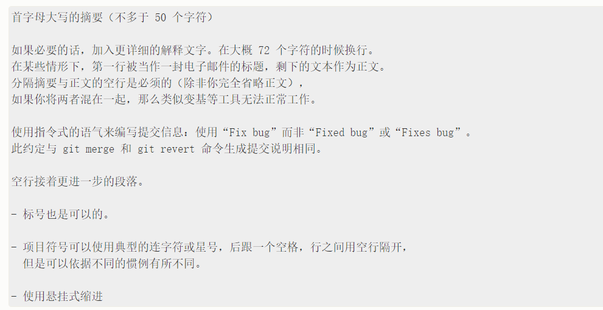

# 4.2 commit 的规范

良好的提交规范使项目管理会更加清晰

## 提交规范

这里有一份 git 官方指定的 commit

https://github.com/git/git/blob/master/Documentation/SubmittingPatches

这里是一份 最初由 Tim Pope 写的模板 [tbaggery - A Note About Git Commit Messages](https://tbaggery.com/2008/04/19/a-note-about-git-commit-messages.html)

## git 项目的前几个提交

可以看出来，git 自己这个项目的提交信息还是很清晰的
