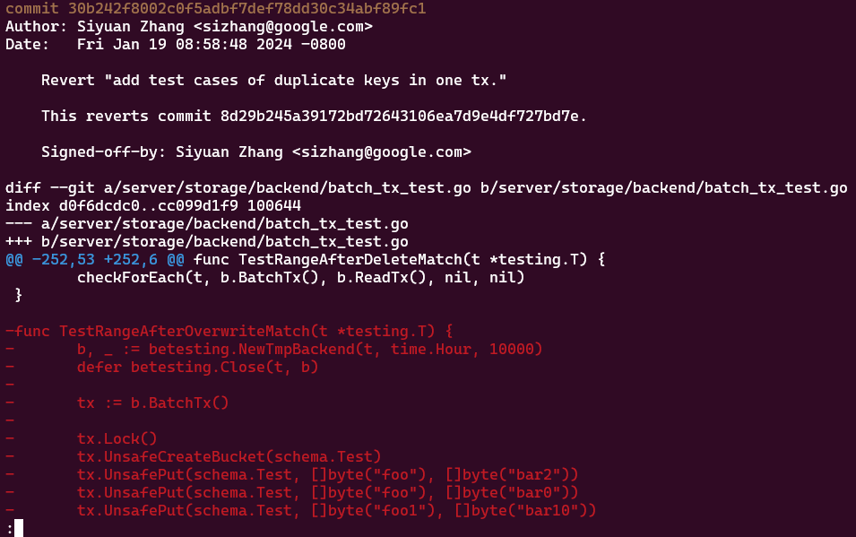

# 4.5 如何查看 git 的提交历史

通过之前介绍的原理可以知道，所有的提交历史都被记录在了 .git 的仓库目录里。所以历史的提交是能够被找回来的。

用过 git 的同学应该知道可以通过 `git log` 来查看历史，下面简单介绍几个例子。

## 4.5.1 git log

```shell
commit 15f95ec49b90fbfd09bc1315cf71d4c1167ee873 (HEAD -> main, origin/main, origin/HEAD)
Merge: dd0b0526e fe03e168a
Author: Benjamin Wang <benjamin.ahrtr@gmail.com>
Date:   Sun Jan 21 14:52:04 2024 +0000

    Merge pull request #17286 from ivanvc/fix-golangci-error-strings-issues

    Fix golangci revive error-strings issues

commit dd0b0526e115bfd2fd34756958262acafbfb6a80
Merge: ef70b13b3 82562abc3
Author: Benjamin Wang <benjamin.ahrtr@gmail.com>
Date:   Sat Jan 20 13:29:04 2024 +0000

    Merge pull request #17284 from ahrtr/test_TestScheduleCompaction_20240119

    Fix test issue in TestScheduleCompaction

commit ef70b13b3a07d25c815d90e7cad2718484bd880b
Merge: 8bd34cf23 feba3ed86
Author: Benjamin Wang <benjamin.ahrtr@gmail.com>
Date:   Fri Jan 19 18:37:53 2024 +0000

    Merge pull request #17273 from iiamabby/devcontainer-kubectl

    Added container tools to devcontainer for debugging prow jobs

commit 8bd34cf236cb37ee0dc6ab2d62e2b6840340fa17
Merge: 6b57b5520 30b242f80
```
git log 会按时间先后顺序列出所有的提交，最近的更新排在最上面。 

正如你所看到的，这个命令会列出每个提交的 SHA-1 校验和、作者的名字和电子邮件地址、提交时间以及提交说明。

## 4.5.2 git log -p -2   显示每次提交所引入的差异



## 4.5.3 git show  查看提交内容

```shell
git show  dd0b0526e115bfd2fd34756958262acafbfb6a80
```


git log 还有更多有趣的参数，可以按照兴趣和自己的习惯使用。
