# 4.6 如何回退到历史的版本呢

同样的，通过 git 的原理可以知道，我们可以回退到任何一个历史版本上。

回退的命令大家可能也比较熟悉，即 `git reset`。 这个命令看似加单，其实也比较绕。


## 4.6.1 理解三棵树（文件的集合）

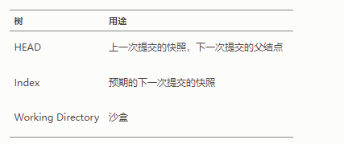

git 很多操作都是围绕着这三课树设计的。

* HEAD： HEAD 是当前分支引用的指针，它总是指向该分支上的最后一次提交（commit 对象）。
```
$ git cat-file -p HEAD
tree cfda3bf379e4f8dba8717dee55aab78aef7f4daf
author Scott Chacon  1301511835 -0700
committer Scott Chacon  1301511835 -0700

initial commit

$ git ls-tree -r HEAD
100644 blob a906cb2a4a904a152...   README
100644 blob 8f94139338f9404f2...   Rakefile
040000 tree 99f1a6d12cb4b6f19...   lib
```
* Index（索引）：索引是你的 预期的下一次提交，就是暂存区（2.1小节介绍过）
```
$ git ls-files -s
100644 a906cb2a4a904a152e80877d4088654daad0c859 0	README
100644 8f94139338f9404f26296befa88755fc2598c289 0	Rakefile
100644 47c6340d6459e05787f644c2447d2595f5d3a54b 0	lib/simplegit.rb
```
* 工作目录（区）： 当前工作区里看到的文件的样子，修改被暂存之前都可以随便修改。

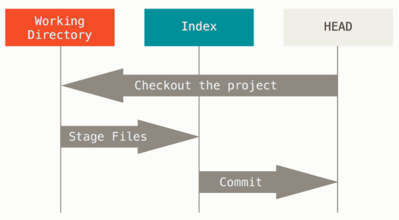

git 工作流如上图所示，前文其实也介绍过。下边举一个提交的例子，看一下这三棵树的变化。


### git init 之后，项目初始的样子

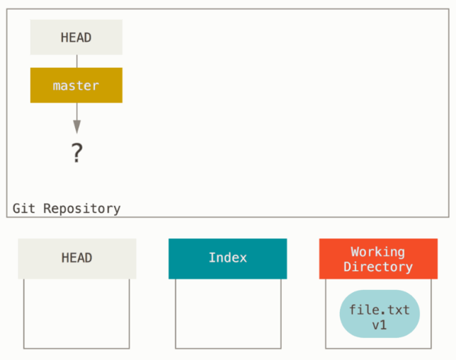
* 只有工作目录有个文件
* 其他两棵树是空的

### git add 把文件加入暂存区 

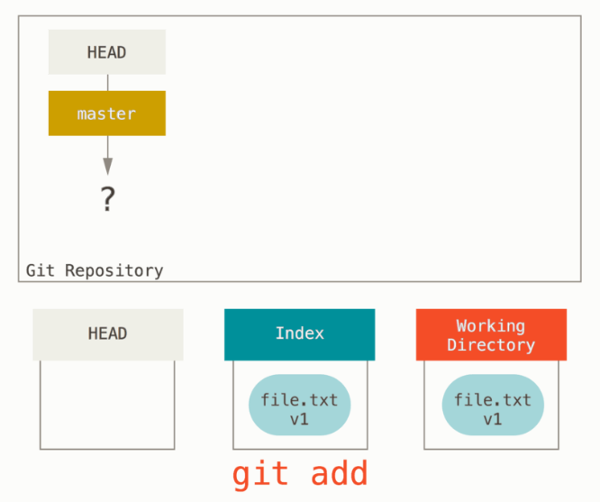

### git commit 之后，三棵树变成一样的了

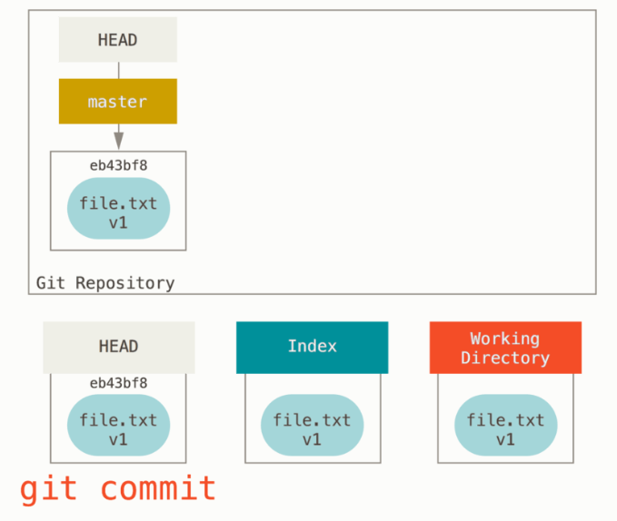


### 再次修改 file.txt 过程也是如此

edit

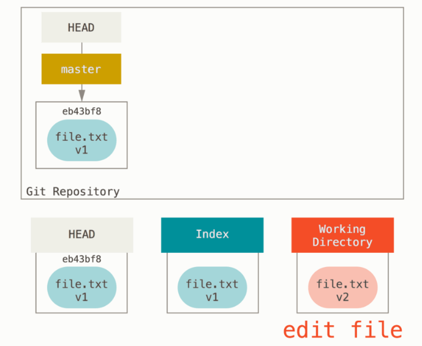

git add

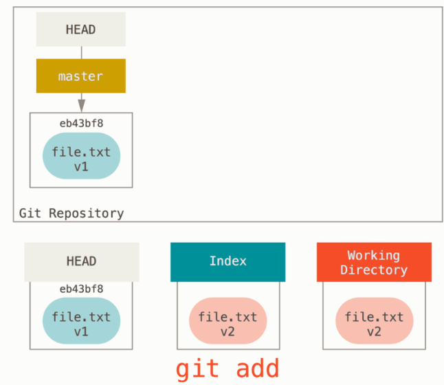

git commit

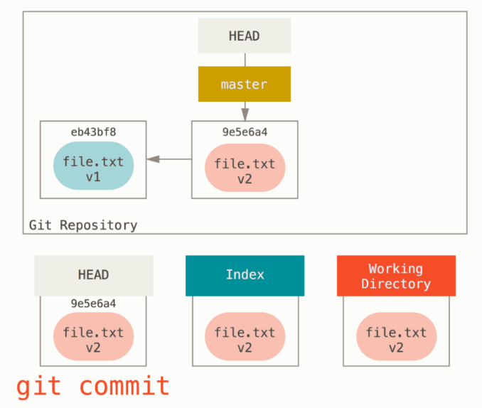


正向的git 工作流就介绍完了，现在你应该明白了“三棵树”的工作流程。那么该进入正题，git 是如何回退的呢？


## 4.6.2 reset 的作用
先把上文的文件进行一次修改，变成 V3 的版本，如下图所示：

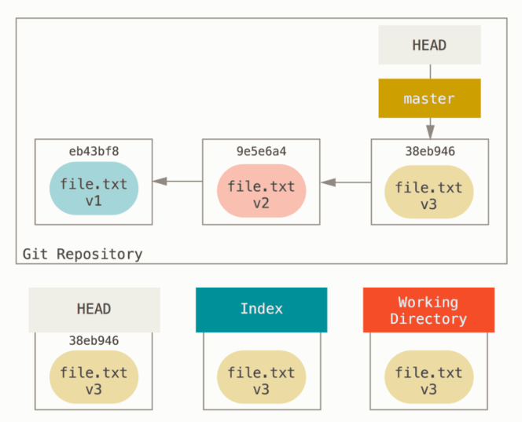

下边看看 reset 做了什么 

```
git reset 9e5e6a4
```

### 移动 HEAD 指针 (git reset/ git reset --soft HEAD~)

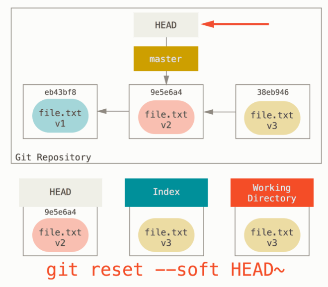

* HEAD 变成 V2，其他两颗树还是 V3


### 更新索引 (git reset --mixed HEAD~)

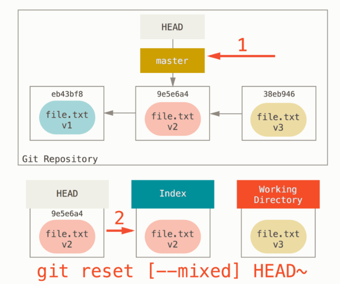
* HEAD 和暂存区变成 V2， 工作目录还是 V3

### 更新工作目录 (git reset --hard HEAD~)

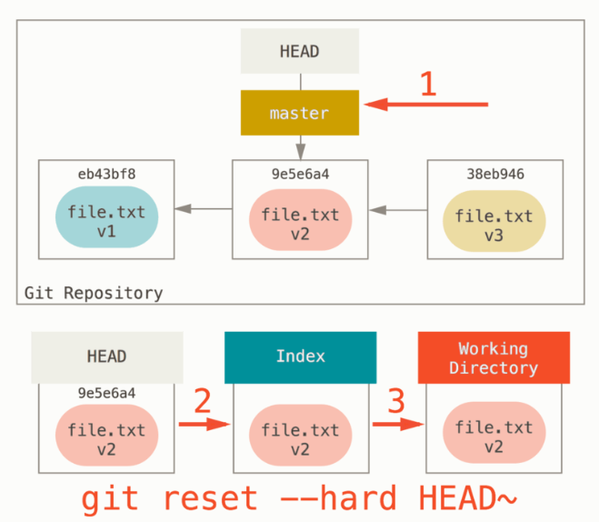

* 三棵树都回退到 V2 了
* --hard 标记是 reset 命令唯一的危险用法，它也是 Git 会真正地销毁数据的仅有的几个操作之一。 
