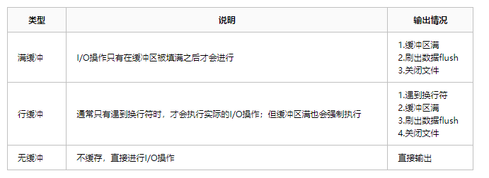

## 怎样重定向某个代码块产生的 stdout 到某个文件，退出这个代码块之后还能恢复正常的 stdout？

如
```python
with RedirectStdOutStdErr(out_file_path):
    print("这行标准输出会打印到 out_file_path 里")

print("这行标准输出会打印到标准的 stdout 里")
```


## 尝试解决
```python
class RedirectStdOutStdErr:
    def __init__(self, out_file_path: str):
        self.plugin_out_path = out_file_path

    def __enter__(self):
        self._save_std_out = sys.stdout
        self._save_std_err = sys.stderr
        self._out_file = open(self.plugin_out_path, 'w+')
        sys.stdout = self._out_file
        sys.stderr = self._out_file

    def __exit__(self, type, value, trace):
        sys.stdout = self._save_std_out
        sys.stderr = self._save_std_err
        self._out_file.close()
```
这段代码的原理是这样的：
* with 包的代码即  `__enter__` 函数做了如下工作：
    * 先把当前的 sys.stdout(err) 保存到一个临时对象里
    * 把 sys.stdout 赋予成 out_file_path 的 file 对象里
    * 此后执行的代码标准输出就被重定向了
* `__exit__` 代码块再把 sys.stdout(err) 改回来就可以了


### 关于 sys.stdout/sys.stderr

官网说明 https://docs.python.org/3/library/sys.html

* sys.stdin
* sys.stdout
* sys.stderr

File objects used by the interpreter for standard input, output and errors:

* stdin is used for all interactive input (including calls to input());
* stdout is used for the output of print() and expression statements and for the prompts of input();
* The interpreter’s own prompts and its error messages go to stderr.

它其实就是 python 的文件对象
```python
>>> sys.stdout
<_io.TextIOWrapper name='<stdout>' mode='w' encoding='utf-8'>
>>> a = open('/home/ning/get-pip.py')
>>> a
<_io.TextIOWrapper name='/home/ning/get-pip.py' mode='r' encoding='UTF-8'>
>>>
```


这里还额外说明了缓存问题
* When interactive, the stdout stream is line-buffered. Otherwise, it is block-buffered like regular text files. 

这个表格说明了不同缓冲模式的行为



## 如果代码块的子进程的 stdout 也想被重定向呢？

上边的方法只能生效于本 python 进程，因为都是再操纵 python 的对象，如果子进程的 stdout 也想被重定向呢？

```python
with RedirectStdOutStdErr(out_file_path):
    print("这行标准输出会打印到 out_file_path 里")
    fork()
    {
        print("子进程的 print 也能要被重定向会打印到 out_file_path 里")
    }

print("这行标准输出会打印到标准的 stdout 里")
```

那就需要通过系统的姿势来解决了：即 hack 0/1/2 文件描述符, 看一下如下代码：

```python
class RedirectStdOutStdErr:
    def __init__(self, out_file_path: str):
        self.plugin_out_path = out_file_path

    def __enter__(self):
        self._save_std_out = os.dup(1)
        self._save_std_err = os.dup(2)
        self.out_file_f = open(self.plugin_out_path, 'w+')
        sys.stdout.flush()
        sys.stderr.flush()
        os.dup2(self.out_file_f.fileno(), 1)
        os.dup2(self.out_file_f.fileno(), 2)

    def __exit__(self, type, value, trace):
        sys.stdout.flush()
        sys.stderr.flush()
        os.dup2(self._save_std_out, 1)
        os.dup2(self._save_std_err, 2)
        self.out_file_f.close()
        os.close(self._save_std_out)
        os.close(self._save_std_err)
```
这里最关键的代码就是：
1. self._save_std_out = os.dup(1)  ## 把描述符为 1 （stdout） 复制一份新的 fd
2. os.dup2(self.out_file_f.fileno(), 1) 把描述符为 1 （stdout） 修改成 out_file_path 的

这样也达到了相同的目的，同时子进程也生效的原因是 fork出来的子进程的 fd table 会继承父进程的。


### 关于 os.dup / os.dup2

* os.dup(fd)
复制指定的文件描述符，返回一个新的的 fd（int 值）
```
Parameter: 
fd: A file descriptor, which is to be duplicated. 
Return Type: This method returns the duplicated file descriptor, which is an integer value. 
```

* os.dup2(fd, fd2, inheritable=True)
把 fd2 复制成 fd
```
Duplicate file descriptor fd to fd2, closing the latter first if necessary. Return fd2. The new file descriptor is inheritable by default or non-inheritable if inheritable is False.
```


## 小节

os.dup 的方法只能说是达到了目的，但其实很不 python，比较优雅的方法可能是重写 sys.stdout 和 fork 的行为。
